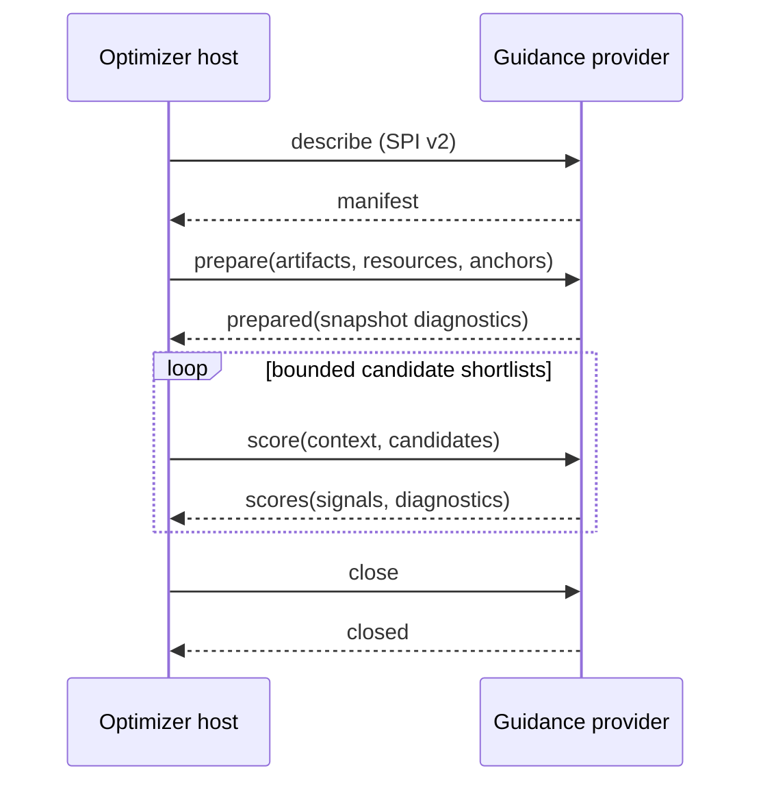

# Guidance add-on SPI v2

`bliss-playlist-guidance-spi` defines the provider-neutral, JSONL process
boundary between `bliss-playlist-optimizer` (the **host**) and optional
guidance providers. The normative machine-readable contract is
[`schemas/guidance-addon-spi-v2.schema.json`](schemas/guidance-addon-spi-v2.schema.json).

## Purpose and boundaries

Bliss remains the authority for acoustic distance, candidate-library
membership, route feasibility, uniqueness, genre restrictions, and repeat
windows. A provider expresses only a bounded preference for candidates the
optimizer has already admitted to a shortlist.

- **Evidence artifact** means immutable, hash-verified input such as resolved
  Last.fm relations.
- **Trusted resource** means a plugin-selected, read-only source that a
  provider may query during a job, such as Lyrion's `persist.db`.
- **Guidance** means a signed, confidence-weighted candidate preference.
- **Reranking** is performed by the host; a provider never mutates a route.

Providers cannot admit excluded tracks, relax repeat windows, or make an
acoustically invalid route valid.

## Transport and trust

The host starts a configured provider and communicates in UTF-8 newline-
delimited JSON (JSONL) on stdin/stdout. One complete JSON object occupies one
line. Providers write no prose or logs to stdout; diagnostic output belongs on
stderr.

Executable paths, arguments, artifact paths, resource paths, and provider
policy are trusted integration configuration. They must never be copied from a
playlist, web form, or other untrusted request input. The host uses finite
timeouts; malformed responses, timeouts, and provider failures disable only
that provider and leave Bliss-only routing available.

## Lifecycle



`prepare` is job-scoped and intentionally contains no decoded Bliss library and
no general candidate inventory. The provider may load its declared artifact or
open its declared trusted resource once. `score` contains only the candidates
being considered at that specific planner boundary.

## Messages

### Describe and manifest

The host starts a session with:

```json
{"type":"describe","spi_version":2}
```

The manifest must report SPI version `2`, protocol
`bliss-playlist-optimizer-guidance-jsonl-v2`, a stable provider ID, version,
and capabilities. The host disables a provider whose manifest does not match
its trusted configuration.

### Prepare

`prepare` supplies provider options, hash-bound artifacts, trusted resources,
and source/history anchors. It does not contain a `candidates` field.

```json
{
  "type":"prepare",
  "spi_version":2,
  "job_id":"preview-42",
  "options":{"preference_percent":-40},
  "artifacts":[{
    "kind":"eligible-candidate-identities-v1",
    "path":"/private/cache/candidate-identities.json",
    "sha256":"0123456789abcdef0123456789abcdef0123456789abcdef0123456789abcdef"
  }],
  "resources":[{
    "kind":"lms-persist-sqlite-v1",
    "path":"/private/lms/persist.db",
    "access":"read_only"
  }],
  "anchors":[]
}
```

Artifacts are immutable during the native process lifetime and are verified by
SHA-256. Resources are live and cannot be hash-verified as job artifacts. A
provider must validate their type, trusted path, read-only access, and expected
schema, then report snapshot metadata in `prepared` diagnostics.

### Score

`score` supplies one bounded shortlist and actual planner context. Candidate
identity may include `lms_urlmd5` for a provider that needs Lyrion database
lookups; it does not give the provider permission to query arbitrary tracks.

```json
{
  "type":"score",
  "spi_version":2,
  "request_id":"gap-7-shortlist-1",
  "context":{"scope":"edge","left_anchor_id":"source-a","right_anchor_id":"source-b","context_track_ids":["source-a"]},
  "candidates":[{"candidate_id":"bliss-row-42","lms_urlmd5":"aabbcc"}]
}
```

Providers return signals only for candidate IDs in that score request. A signal
has a `scope`, `score` in `[-1, 1]`, `confidence` in `[0, 1]`, and optional
concise rationale and observation time. Omitting a candidate is neutral.

```json
{
  "type":"scores",
  "provider_id":"playcount-guidance",
  "request_id":"gap-7-shortlist-1",
  "signals":[{"candidate_id":"bliss-row-42","scope":"global","score":-0.6,"confidence":1.0,"rationale":"LMS play-count percentile 0.200"}],
  "diagnostics":{"state":"fresh","request_count":2,"failure_count":0}
}
```

### Close and errors

The host sends `{"type":"close","spi_version":2}` after a healthy job.
Providers must also tolerate closed pipes or termination after a timeout.
Errors contain a stable `code`, actionable `message`, and `retryable` flag.
They are advisory: the host records them and continues without that provider.

## Provider requirements

- Validate SPI version, declared artifact hashes, resource type, and schema.
- Read or index long-lived input during `prepare`, not repeatedly during
  `score`.
- Keep stdout exclusively for one JSONL response per request.
- Return only requested IDs and bounded signal values.
- Treat unavailable evidence as neutral; never weaken Bliss hard constraints.
- Keep score calls bounded and avoid a network request, LMS API call, or
  unbounded data transfer per candidate.
- Emit aggregate diagnostics without private music paths at INFO-level use.

## Compatibility

SPI v2 deliberately replaces v1. A host and provider must agree on both the
version and protocol string; otherwise the host disables the provider for that
job. No v1-to-v2 compatibility shim is defined.
