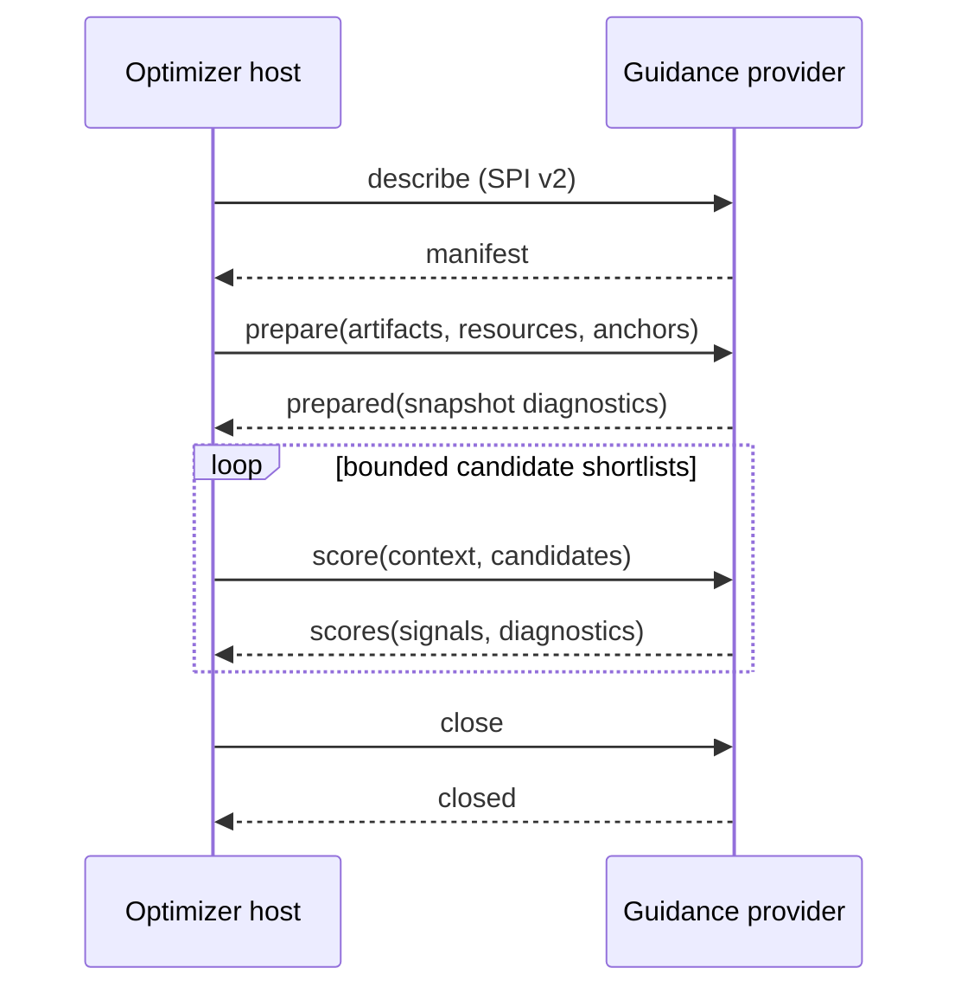

# Guidance add-on SPI v2

`bliss-playlist-guidance-spi` defines the provider-neutral, JSONL process
boundary between a Bliss-first **host** and optional guidance providers. The
current host is `bliss-playlist-optimizer`; a later `bliss-mixer` host may use
the identical contract while ranking its DSTM candidate pool. The normative
machine-readable contract is
[`schemas/guidance-addon-spi-v2.schema.json`](schemas/guidance-addon-spi-v2.schema.json).

## Purpose and boundaries

Bliss remains the authority for acoustic distance and candidate admission. The
host remains responsible for its own feasibility, uniqueness, genre, repeat,
and selection rules. A provider expresses only a bounded preference for
candidates the host has already admitted to a shortlist.

- **Evidence artifact** means immutable, hash-verified input such as resolved
  Last.fm relations.
- **Trusted resource** means a plugin-selected, read-only source that a
  provider may query during a job, such as Lyrion's `persist.db`.
- **Guidance** means a signed, confidence-weighted candidate preference.
- **Reranking** is performed by the host; a provider never mutates a route.

Providers cannot admit excluded tracks, relax repeat windows, or make an
acoustically invalid route valid.

## Transport and trust

The host starts a configured provider and communicates in UTF-8 newline-
delimited JSON (JSONL) on stdin/stdout. One complete JSON object occupies one
line. Providers write no prose or logs to stdout; diagnostic output belongs on
stderr.

Executable paths, arguments, artifact paths, resource paths, and provider
policy are trusted integration configuration. They must never be copied from a
playlist, web form, or other untrusted request input. The host uses finite
timeouts; malformed responses, timeouts, and provider failures disable only
that provider and leave Bliss-only routing available.

## Lifecycle



`prepare` is job-scoped and intentionally contains no decoded Bliss library and
no general candidate inventory. The provider may load its declared artifact or
open its declared trusted resource once. It also receives the host's stable
source and listening-history anchors, so it can derive a small, job-local
identity index before scoring begins. `score` contains only the candidates
being considered at that specific planner boundary.

## Messages

### Describe and manifest

The host starts a session with:

```json
{"type":"describe","spi_version":2}
```

The manifest must report SPI version `2`, protocol `bliss-guidance-jsonl-v2`, a
stable provider ID, version, and capabilities. The host disables a provider
whose manifest does not match its trusted configuration.

### Prepare

`prepare` supplies provider options, hash-bound artifacts, trusted resources,
and source/history anchors. It does not contain a `candidates` field.

```json
{
  "type":"prepare",
  "spi_version":2,
  "job_id":"preview-42",
  "options":{"preference_percent":-40},
  "artifacts":[{
    "kind":"eligible-candidate-identities-v1",
    "path":"/private/cache/candidate-identities.json",
    "sha256":"0123456789abcdef0123456789abcdef0123456789abcdef0123456789abcdef"
  }],
  "resources":[{
    "kind":"lms-persist-sqlite-v1",
    "path":"/private/lms/persist.db",
    "access":"read_only"
  }],
  "anchors":[]
}
```

Artifacts are immutable during the native process lifetime and are verified by
SHA-256. Resources are live and cannot be hash-verified as job artifacts. A
provider must validate their type, trusted path, read-only access, and expected
schema, then report snapshot metadata in `prepared` diagnostics.

### Anchors and identity translation

`anchor_id` is the host's stable route-context token. The host uses it in
`context_track_ids`, `left_anchor_id`, and `right_anchor_id`; it is normally a
local track ID such as `lms-track-123`, not an identifier owned by a guidance
source. An anchor also carries the local track identity and optional metadata:
`candidate_id`, `lms_urlmd5`, `recording_mbid`, `artist_mbids`, `artist`, and
so on.

This distinction is deliberate. A provider whose evidence is keyed by another
entity type must translate once during `prepare`, then keep the mapping local to
that job. For example, a Last.fm provider can map a host track anchor through
its artist MBID to a Last.fm artist source ID:

```text
score context: lms-track-123
  -> prepare anchor artist_mbids: [MusicBrainz artist MBID]
  -> evidence source: artist:normalized-lastfm-artist
  -> resolved local candidate: bliss-row-456
```

Providers must prefer stable foreign identifiers such as MusicBrainz IDs. A
conservative normalized-name fallback is acceptable only when the stable
mapping is unavailable; providers must describe that fallback in their own
diagnostics and product documentation.
They must apply the resulting relation to every relevant context form: global
`context_track_ids` as well as the left and right anchors of an edge. A provider
never substitutes its source ID into the host's score context and never emits a
signal for a candidate that is not in the supplied bounded batch.

### Score

`score` supplies one bounded shortlist and actual planner context. Context IDs
refer to `prepare` anchor IDs, not provider-specific source identities.
Candidate identity may include `lms_urlmd5` for a provider that needs Lyrion
database lookups; it does not give the provider permission to query arbitrary
tracks.

```json
{
  "type":"score",
  "spi_version":2,
  "request_id":"gap-7-shortlist-1",
  "context":{"scope":"edge","left_anchor_id":"source-a","right_anchor_id":"source-b","context_track_ids":["source-a"]},
  "candidates":[{"candidate_id":"bliss-row-42","lms_urlmd5":"aabbcc"}]
}
```

Providers return signals only for candidate IDs in that score request. A signal
has a stable provider-defined `channel` such as `lastfm_track`,
`lastfm_artist`, `playcount`, `last_played`, or `library_age`; a `scope`; `score` in `[-1, 1]`;
`confidence` in `[0, 1]`; and optional concise rationale and observation time.
Omitting a candidate is neutral.

```json
{
  "type":"scores",
  "provider_id":"library-signals-guidance",
  "request_id":"gap-7-shortlist-1",
  "signals":[{"candidate_id":"bliss-row-42","channel":"playcount","scope":"global","score":-0.6,"confidence":1.0,"rationale":"LMS play-count percentile 0.200"}],
  "diagnostics":{"state":"fresh","request_count":2,"failure_count":0}
}
```

### Worked Better Call Bliss job: Last.fm plus local library signals

The following is a shortened but wire-valid transcript from one realistic
Better Call Bliss addition or bridge decision. It shows two separate provider
sessions: Last.fm receives a frozen artifact; local library signals receive a frozen
candidate-identity artifact and a read-only Lyrion database resource. Paths,
hashes, titles, and IDs are representative placeholders.

The host starts each provider with `describe`, validates its manifest, then
sends the provider-specific `prepare` message. Both providers receive the same
source/history anchors, although only the Last.fm provider needs them here.

**Host -> `bliss-guidance-lastfm`: prepare**

```json
{
  "type":"prepare",
  "spi_version":2,
  "job_id":"preview-1790300000-example",
  "options":{},
  "artifacts":[{
    "kind":"resolved-lastfm-evidence-v1",
    "path":"/var/lib/lms/cache/bettercallbliss/jobs/preview-1790300000-example/semantic-evidence.json",
    "sha256":"c65f0a1427f11bc7bdb2c6fb8b2198c9f9b26077f7e38b529a90c173b27e60d4"
  }],
  "resources":[],
  "anchors":[
    {
      "anchor_id":"lms-track-2623395",
      "candidate_id":"lms-track-2623395",
      "lms_urlmd5":"715fc0244e47c4c86ee1c0119f81f8b4",
      "title":"Example source track",
      "artist":"Example Artist",
      "recording_mbid":"0bf802b1-e0e5-4c15-a283-2ab14e49b6a5",
      "artist_mbids":["0c5cd5d6-27c5-42df-859f-f0bf9276d3b0"]
    },
    {
      "anchor_id":"lms-track-2623412",
      "candidate_id":"lms-track-2623412",
      "lms_urlmd5":"9f1742bb2b1c01fd42e0251f32641dc0",
      "title":"Example right endpoint",
      "artist":"Another Artist",
      "artist_mbids":["6d7b7cd5-0931-4d1b-96af-a8e4d63553bd"]
    }
  ]
}
```

The Last.fm provider verifies the artifact hash, indexes its locally resolved
recording and artist edges, and builds an in-memory mapping such as
`lms-track-2623395 -> artist:example-artist` through the artist MBID. A
representative response is:

```json
{
  "type":"prepared",
  "provider_id":"lastfm-guidance",
  "snapshot_id":"c65f0a1427f11bc7:sources:42",
  "diagnostics":{
    "state":"fresh",
    "request_count":1,
    "failure_count":0,
    "details":{"source_entities":42,"track_artist_mappings":2,"resolved_candidate_edges":318}
  }
}
```

**Host -> `bliss-guidance-library-signals`: prepare**

```json
{
  "type":"prepare",
  "spi_version":2,
  "job_id":"preview-1790300000-example",
  "options":{},
  "artifacts":[{
    "kind":"eligible-candidate-identities-v1",
    "path":"/var/lib/lms/cache/bettercallbliss/jobs/preview-1790300000-example/candidate-identities.json",
    "sha256":"c2865b8f478a388f2361a2f4b2bd563b4647824f339a3023c7e25b4c7071348d"
  }],
  "resources":[{
    "kind":"lms-persist-sqlite-v1",
    "path":"/var/lib/lms/cache/persist.db",
    "access":"read_only"
  }],
  "anchors":[
    {"anchor_id":"lms-track-2623395","candidate_id":"lms-track-2623395"},
    {"anchor_id":"lms-track-2623412","candidate_id":"lms-track-2623412"}
  ]
}
```

The local-library-signals provider verifies the identity artifact, opens one
read-only SQLite snapshot, and builds three eligible-population distributions:
`playcount`, `last_played`, and `library_age`. It does not receive an exported
library-wide value map. A missing persistence row is neutral; `lastPlayed = 0`
is the oldest recency value and a missing `added` value omits `library_age`.

```json
{
  "type":"prepared",
  "provider_id":"library-signals-guidance",
  "snapshot_id":"sqlite:c2865b8f478a388f:64128",
  "diagnostics":{
    "state":"fresh",
    "request_count":1,
    "failure_count":0,
    "details":{"eligible_candidates":64128,"known_playcounts":51890,"known_last_played":51890,"known_library_age":51742}
  }
}
```

After Bliss, virtual-library, genre, and repeat checks, the host has a bounded
acoustic shortlist. It sends that exact shortlist and the actual planning
context to both providers:

```json
{
  "type":"score",
  "spi_version":2,
  "request_id":"gap-4-shortlist-1",
  "context":{
    "scope":"edge",
    "left_anchor_id":"lms-track-2623395",
    "right_anchor_id":"lms-track-2623412",
    "context_track_ids":["lms-track-2623395"]
  },
  "candidates":[
    {"candidate_id":"bliss-row-51431","lms_urlmd5":"d8399ff136003de26ce37d8024c6ec2b","title":"Example candidate A","artist":"Related Artist"},
    {"candidate_id":"bliss-row-51432","lms_urlmd5":"ec8074cec6243e8bbad23095109d6744","title":"Example candidate B","artist":"Other Artist"}
  ]
}
```

**`bliss-guidance-lastfm` -> host: scores**

```json
{
  "type":"scores",
  "provider_id":"lastfm-guidance",
  "request_id":"gap-4-shortlist-1",
  "signals":[{
    "candidate_id":"bliss-row-51431",
    "channel":"lastfm_artist",
    "scope":"edge",
    "score":0.76,
    "confidence":1.0,
    "rationale":"Last.fm similar artist"
  }],
  "diagnostics":{"state":"fresh","request_count":1,"failure_count":0}
}
```

**`bliss-guidance-library-signals` -> host: scores**

```json
{
  "type":"scores",
  "provider_id":"library-signals-guidance",
  "request_id":"gap-4-shortlist-1",
  "signals":[
    {
      "candidate_id":"bliss-row-51431",
      "channel":"playcount",
      "scope":"global",
      "score":-0.62,
      "confidence":1.0,
      "rationale":"LMS play-count percentile 0.190"
    },
    {
      "candidate_id":"bliss-row-51432",
      "channel":"playcount",
      "scope":"global",
      "score":0.35,
      "confidence":1.0,
      "rationale":"LMS play-count percentile 0.675"
    }
  ],
  "diagnostics":{"state":"fresh","request_count":1,"failure_count":0}
}
```

For a job policy of `lastfm_artist` target share `25` and play-count influence
`-40`, the host records the separate contributions for each chosen candidate.
The negative play-count weight boosts candidate A because its signal is below
the population median; the positive Last.fm artist signal is independent. The
host then combines only these bounded contributions with its Bliss-derived
route objective. It may still select candidate B or neither candidate if the
acoustic route, repeat windows, or other hard rules are better.

### Close and errors

The host sends `{"type":"close","spi_version":2}` after a healthy job.
Providers must also tolerate closed pipes or termination after a timeout.
Errors contain a stable `code`, actionable `message`, and `retryable` flag.
They are advisory: the host records them and continues without that provider.

## Provider requirements

- Validate SPI version, declared artifact hashes, resource type, and schema.
- Read or index long-lived input during `prepare`, not repeatedly during
  `score`.
- Keep stdout exclusively for one JSONL response per request.
- Return only requested IDs and bounded signal values.
- Treat unavailable evidence as neutral; never weaken Bliss hard constraints.
- Keep score calls bounded and avoid a network request, LMS API call, or
  unbounded data transfer per candidate.
- Emit aggregate diagnostics without private music paths at INFO-level use.

## Compatibility

SPI v2 deliberately replaces v1. A host and provider must agree on both the
version and protocol string; otherwise the host disables the provider for that
job. No v1-to-v2 compatibility shim is defined.
