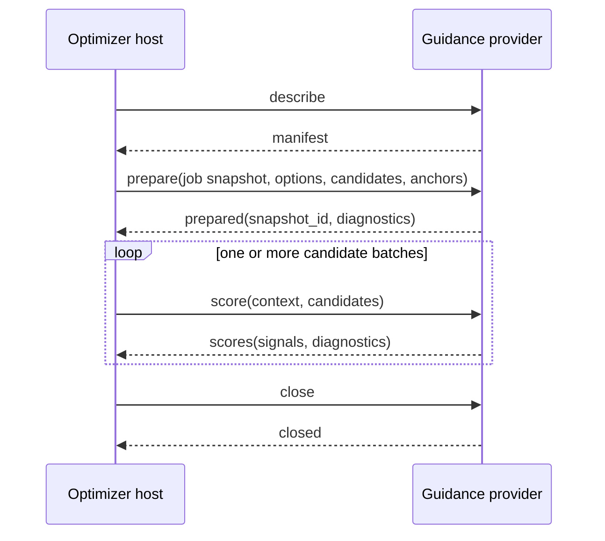

# Guidance add-on SPI v1

`bliss-playlist-guidance-spi` defines the provider-neutral process boundary
between `bliss-playlist-optimizer` (the **host**) and optional guidance add-ons
(the **providers**). The normative machine-readable contract is
[`schemas/guidance-addon-spi-v1.schema.json`](schemas/guidance-addon-spi-v1.schema.json).

## Scope and vocabulary

Bliss remains the authority for acoustic distance, route feasibility, eligible
local-library membership, uniqueness, and artist/album/track repeat windows. An
add-on can only express a preference for candidates that the optimizer has
already admitted.

- **Evidence** is a raw, frozen observation: for example a Last.fm relation or
  an LMS play-count snapshot.
- **Guidance** is the normalized, bounded candidate preference derived from
  evidence.
- **Reranking** is the host-side operation that may combine Bliss ranking and
  guidance. A provider does not rerank a route.

Therefore a provider cannot admit an excluded track, permit a repeat-window
violation, or make an acoustically invalid route valid.

## Process and trust boundary

The host starts a configured provider as a child process and communicates in
UTF-8 newline-delimited JSON (JSONL) over stdin/stdout. Each complete JSON
object occupies one line. Providers must not write prose, logs, banners, or
extra lines to stdout; use stderr for diagnostics if needed. Each request
receives at most one response.

The executable path and arguments in `guidance_addons` are trusted integration
configuration, not playlist or web-form input. The host applies a finite
timeout. A malformed response, timeout, or provider failure produces neutral
guidance rather than failing a Bliss-only route.

The current optimizer host validates providers, prepares them with a frozen job
snapshot, and records bounded signals and diagnostics in the native artifact.
Provider-specific signals are not yet used to select a route; the later
reranking integration will use this same SPI boundary for every planner.

## Lifecycle



The host may omit a provider, make no score calls after preparation, or kill a
timed-out process without `close`. A provider must reject `score` before a
successful `prepare` with a non-retryable `NOT_PREPARED` error.

## Manifest discovery

The host begins with:

```json
{ "type": "describe", "spi_version": 1 }
```

The `manifest` response must use SPI version `1`, protocol
`bliss-playlist-optimizer-guidance-jsonl`, and the provider ID by which the host
configured it. A mismatch disables that provider for the job.

| Manifest field         | Meaning                                                          |
| ---------------------- | ---------------------------------------------------------------- |
| `provider_id`          | Stable identity, for example `lastfm-guidance`.                  |
| `provider_version`     | Build/version recorded in diagnostics.                           |
| `capabilities`         | `global_candidate_guidance`, `edge_candidate_guidance`, or both. |
| `required_context`     | Declared prerequisites, such as candidate identity.              |
| `configuration_schema` | Optional JSON Schema for provider-specific `prepare.options`.    |

Global guidance describes a candidate independently of a transition. Edge
guidance describes a candidate for the route boundary between supplied anchors.

## Prepare: freeze provider input

The host sends one job-scoped `prepare` request with a `job_id`, trusted
provider `options`, the frozen local `candidates` inventory, and immutable
source/history `anchors`. A `Candidate` has a stable `candidate_id` and may
include database path, title, artist, album, recording MBID, and artist MBIDs.
An `Anchor` has an `anchor_id` plus the same track fields. Metadata lets a
provider resolve evidence; stable IDs let the host safely use returned signals.

The provider returns `prepared` with an optional `snapshot_id` and
`Diagnostics`. The snapshot ID identifies its frozen input. Diagnostics may
include provider state, request/failure counters, and structured details.

## Score: return bounded guidance

Each `score` request has a `request_id`, `ScoreContext`, and a candidate batch.
The context scope is either `global` (candidate preference independent of a
transition) or `edge` (preference for the boundary between `left_anchor_id` and
`right_anchor_id`). Either anchor may be absent for a one-sided opening or
closing context. `context_track_ids` is an ordered immutable suffix, not
permission for a provider to mutate the route.

Each returned `GuidanceSignal` has the following contract:

| Field          | Required behavior                                                         |
| -------------- | ------------------------------------------------------------------------- |
| `candidate_id` | Must identify a candidate in that request batch.                          |
| `scope`        | Global or edge, matching the intended use.                                |
| `score`        | Signed preference in `[-1, 1]`: positive supports and negative de-boosts. |
| `confidence`   | Confidence in `[0, 1]`; it does not replace score.                        |
| `rationale`    | Optional concise, diagnostic explanation.                                 |
| `observed_at`  | Optional raw-evidence timestamp.                                          |

The host clamps score and confidence to these ranges. A provider should omit
candidates for which it has no meaningful guidance; an absent signal is neutral.

## Errors and closure

An `error` response contains a stable `code`, actionable `message`, and
`retryable` flag. A missing snapshot, no usable evidence, a crashed provider, or
a timeout never relaxes acoustic or repeat constraints. The host records the
failure and continues with neutral guidance.

For a healthy session, the host sends:

```json
{ "type": "close", "spi_version": 1 }
```

The provider replies with `closed` and exits. It must also tolerate the host
closing pipes or killing a failed process.

## Minimal exchange

```json
{"type":"describe","spi_version":1}
{"type":"manifest","spi_version":1,"provider_id":"example-guidance","provider_version":"0.1.0","protocol":"bliss-playlist-optimizer-guidance-jsonl","capabilities":["edge_candidate_guidance"],"required_context":["candidate_identity"],"configuration_schema":null}
{"type":"prepare","spi_version":1,"job_id":"job-42","options":{"artifact_path":"/tmp/evidence.json"},"candidates":[{"candidate_id":"bliss-row-42"}],"anchors":[{"anchor_id":"left","candidate_id":"source-a"},{"anchor_id":"right","candidate_id":"source-b"}]}
{"type":"prepared","provider_id":"example-guidance","snapshot_id":"evidence-42","diagnostics":{"state":"fresh","request_count":1,"failure_count":0}}
{"type":"score","spi_version":1,"request_id":"gap-1","context":{"scope":"edge","left_anchor_id":"left","right_anchor_id":"right","context_track_ids":["left"]},"candidates":[{"candidate_id":"bliss-row-42"}]}
{"type":"scores","provider_id":"example-guidance","request_id":"gap-1","signals":[{"candidate_id":"bliss-row-42","scope":"edge","score":0.8,"confidence":0.9,"rationale":"example relation"}],"diagnostics":{"state":"fresh","request_count":1,"failure_count":0}}
{"type":"close","spi_version":1}
{"type":"closed","provider_id":"example-guidance"}
```

The lines are in request/response order. In a real session the host writes
requests and the provider writes only responses.

## Provider checklist

- Use a stable provider ID, SPI version, and protocol.
- Read provider-specific configuration only from `prepare.options`.
- Freeze raw input during `prepare`; do not fetch mutable data during `score`.
- Return only candidate IDs from the request batch and bound every signal.
- Keep stdout exclusively for JSONL responses.
- Represent no match with empty `scores`, not an invented negative signal.
- Treat failure as advisory and never weaken Bliss hard constraints.
